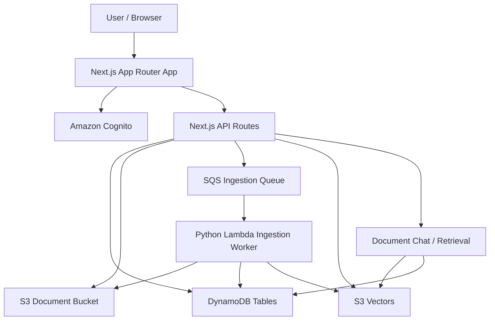
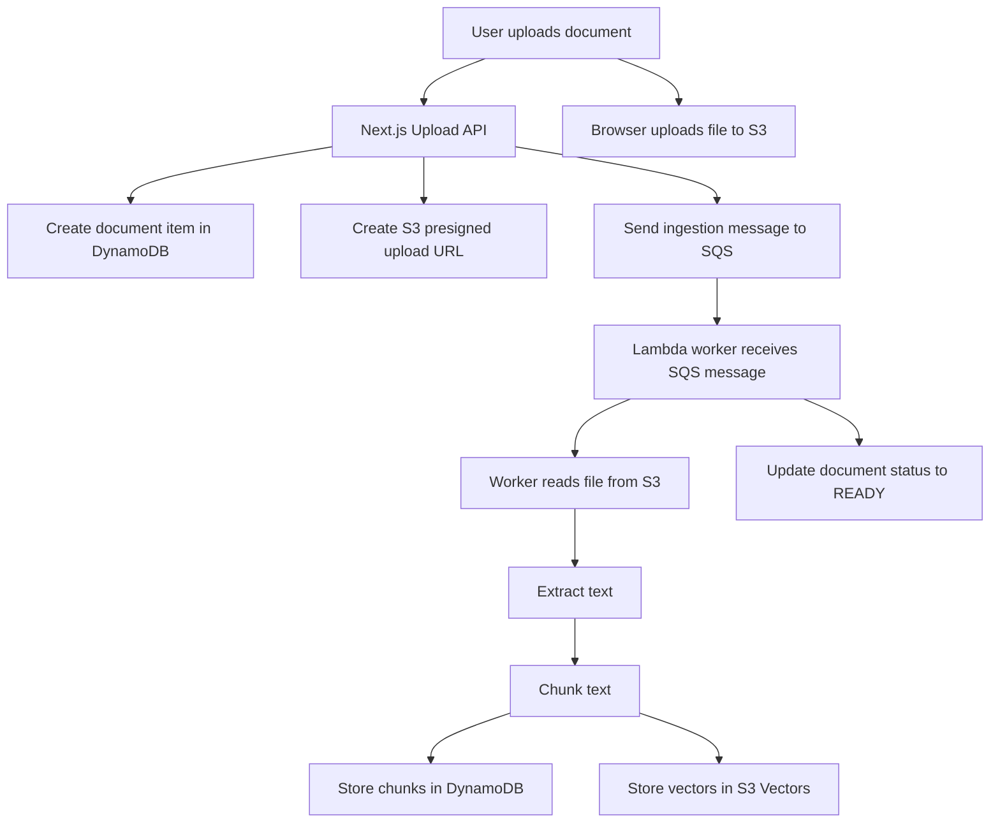
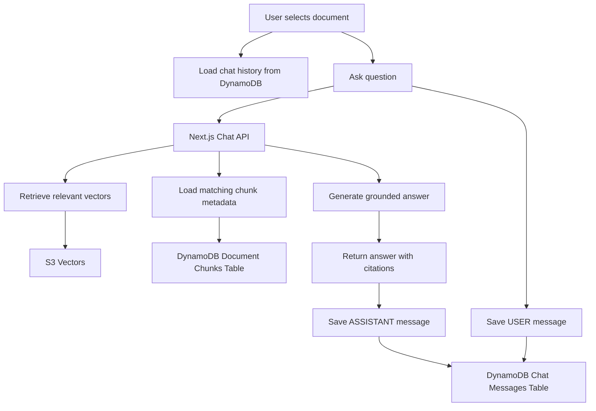

# AWS Architecture

This document describes the AWS architecture used in the AYD Workspace SaaS application.

AYD uses AWS-native services for authentication, document storage, metadata, asynchronous ingestion, vector storage, and document-grounded chat.

---

## AWS Services Used

AYD Phase 1 currently uses the following AWS services:

- Amazon Cognito
- Amazon S3
- Amazon DynamoDB
- Amazon SQS
- AWS Lambda
- Amazon S3 Vectors
- AWS SAM / CloudFormation

---

## Current AWS Architecture Diagram



---

## Service Responsibilities

### 1. Amazon Cognito

Amazon Cognito is used for user authentication.

Responsibilities:

- User login
- User session handling
- Protected app access
- Current user identity

The Next.js application uses Cognito session data to protect API routes and application pages.

---

### 2. Amazon S3

Amazon S3 stores uploaded document files.

Responsibilities:

- Store original uploaded PDFs/documents
- Support direct upload using presigned URLs
- Allow ingestion workers to read uploaded files

Current document storage flow:

```txt
User selects file
→ Next.js API creates document metadata
→ Next.js API creates presigned S3 upload URL
→ Browser uploads file directly to S3
```

S3 stores the file, while DynamoDB stores metadata such as document ID, workspace ID, file name, storage key, file size, status, and timestamps.

---

### 3. Amazon DynamoDB

DynamoDB is the main metadata store for AYD Phase 1.

It stores:

- workspaces
- workspace members
- users
- documents
- document chunks
- document-scoped chat messages

Current important tables:

```txt
ayd-workspaces-dev
ayd-workspace-members-dev
ayd-users-dev
ayd-documents-dev
ayd-document-chunks-dev
ayd-chat-messages-dev
```

DynamoDB replaced the earlier PostgreSQL/RDS planning for the current AYD architecture.

---

### 4. Amazon SQS

Amazon SQS is used for asynchronous document ingestion.

Responsibilities:

- Decouple file upload from heavy document processing
- Send ingestion jobs to the worker
- Allow retry behavior when ingestion fails
- Support dead-letter queue handling for failed messages

Current ingestion flow:

```txt
Document upload completed
→ ingestion message sent to SQS
→ Lambda worker consumes message
→ worker extracts and chunks document
→ worker stores chunks and vectors
→ document status becomes READY
```

---

### 5. AWS Lambda

AWS Lambda runs the document ingestion worker.

Current worker responsibility:

- Receive SQS ingestion messages
- Read document file from S3
- Extract PDF text
- Chunk extracted text
- Store chunk metadata in DynamoDB
- Store vectors in S3 Vectors
- Update document status in DynamoDB

The ingestion worker is written in Python.

---

### 6. Amazon S3 Vectors

AYD uses S3 Vectors as the vector storage layer.

Responsibilities:

- Store document chunk embeddings/vectors
- Retrieve relevant chunks for document Q&A
- Support citation-backed answers

In the chat flow, AYD retrieves relevant document chunks from S3 Vectors and uses them to generate grounded answers.

---

### 7. AWS SAM / CloudFormation

AWS SAM is used to define and deploy AWS infrastructure.

Responsibilities:

- Define DynamoDB tables
- Define S3 buckets
- Define SQS queues and DLQ
- Define Lambda functions
- Define IAM roles and permissions
- Deploy infrastructure changes through CloudFormation

Main infrastructure file:

```txt
template.yaml
```

---

## Document Upload Flow



---

## Document Chat Flow



---

## Chat Messages Table Design

AYD stores document-specific chat history in DynamoDB.

Table:

```txt
ayd-chat-messages-dev
```

Each chat message is scoped by:

```txt
workspaceId + documentId
```

Key pattern:

```txt
pk = WORKSPACE#<workspaceId>#DOCUMENT#<documentId>
sk = MESSAGE#<createdAt>#<messageId>
```

Allowed message roles:

```txt
USER
ASSISTANT
```

This allows each document/PDF to maintain its own independent chat history.

---

## Document Delete Cleanup Flow

When a document is deleted, AYD cleans up related AWS resources and metadata.

Delete flow:

```txt
Delete S3 document file
→ Delete document chunks from DynamoDB
→ Delete vectors from S3 Vectors
→ Delete document chat messages from DynamoDB
→ Delete document metadata from DynamoDB
```

This prevents orphan files, chunks, vectors, and chat messages from remaining after a document is removed.

---

## Current Environment Naming

Current development resources use the `dev` suffix.

Examples:

```txt
ayd-workspaces-dev
ayd-documents-dev
ayd-document-chunks-dev
ayd-chat-messages-dev
```

Infrastructure names are generated using the environment value in `template.yaml`.

---

## Current Phase 1 AWS Status

Completed AWS-backed functionality:

- Cognito authentication
- S3 document upload
- DynamoDB workspace metadata
- DynamoDB document metadata
- DynamoDB workspace members
- DynamoDB users table
- SQS-based ingestion queue
- Python Lambda ingestion worker
- PDF extraction and chunking
- DynamoDB document chunks
- S3 Vectors storage
- Document-grounded chat retrieval
- DynamoDB document-scoped chat history
- Cleanup of S3 file, chunks, vectors, chat messages, and document metadata on delete

---

