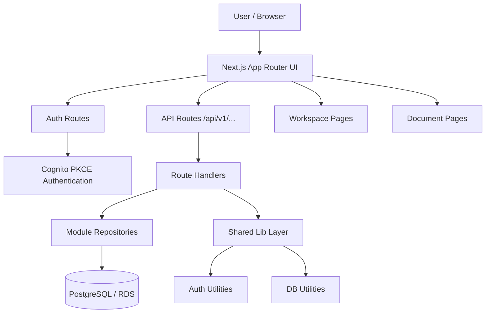
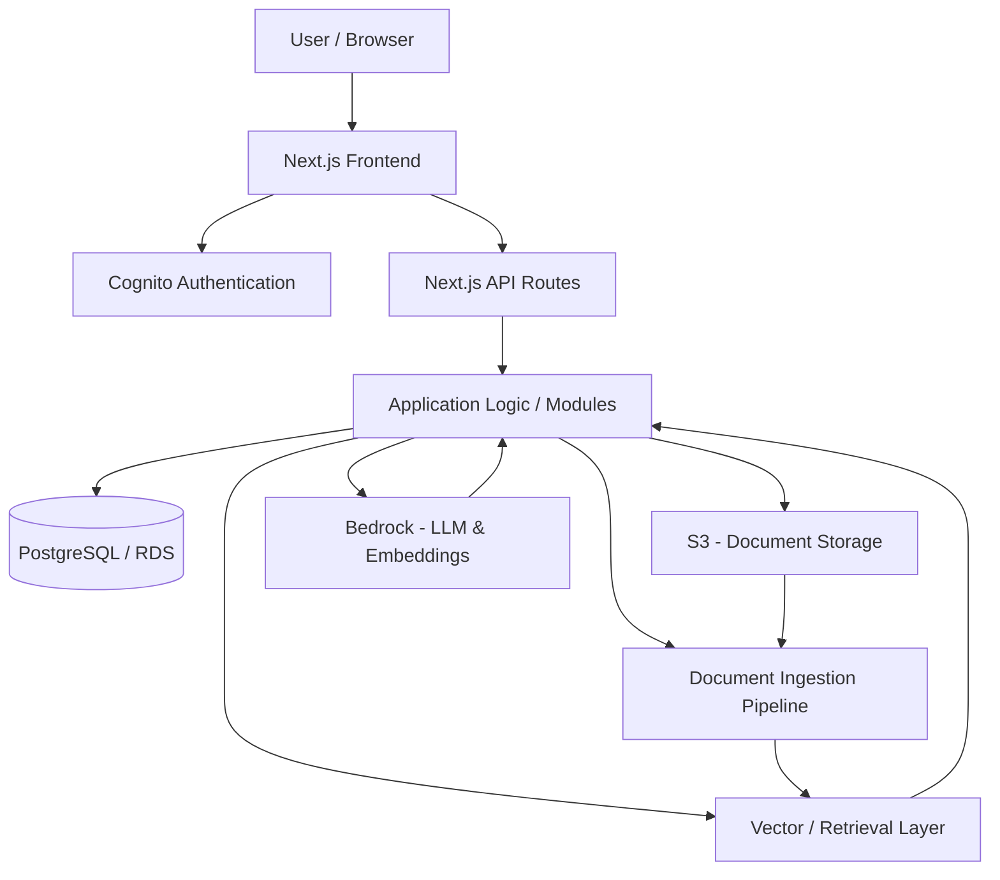

# High-Level Architecture

AYD Workspace SaaS is a workspace-first document and chat application built with Next.js App Router.  
The current architecture focuses on a clean modular application structure, server-side APIs, PostgreSQL-backed metadata storage, and a future-ready document ingestion + RAG pipeline.

---

## Current Architecture Diagram

# Planned Product Architecture

Architecture Layers
1. Frontend Layer
Built with Next.js App Router
UI pages live under src/app
Reusable UI components live under src/components
Feature-specific UI lives under src/modules
2. Authentication Layer
Uses Amazon Cognito with PKCE
Session handling is managed through auth routes and shared auth utilities
3. API Layer
Implemented using Next.js route handlers
Routes live under src/app/api
Responsible for request validation, auth checks, and orchestration
4. Domain / Module Layer
Business logic is organized by feature
Example:
src/modules/workspace
future src/modules/documents
5. Data Layer
PostgreSQL / RDS stores relational application data such as:
workspaces
memberships
documents metadata
future application records
6. Document Storage Layer
S3 stores uploaded files
Database stores file metadata, ownership, and processing state
7. AI / Retrieval Layer
Planned RAG pipeline will include:
document ingestion
chunking
embeddings
retrieval
grounded chat responses
8. LLM Layer
Amazon Bedrock will power generation and embeddings in the AI workflow
