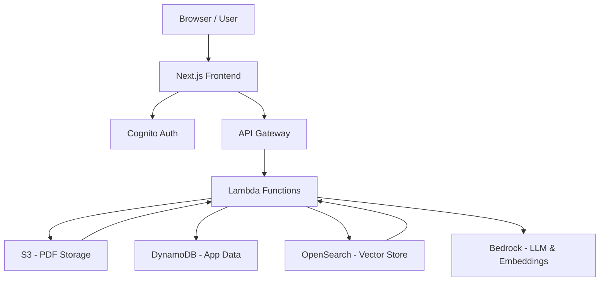

## Architecture Diagram

```mermaid
flowchart TD

    A[Browser / User] --> B[Next.js Frontend]

    B --> C[Cognito Auth]
    B --> D[API Gateway]

    D --> E[Lambda Functions]

    E --> F[S3 - PDF Storage]
    E --> G[DynamoDB - App Data]
    E --> H[OpenSearch - Vector Store]

    E --> I[Bedrock - LLM & Embeddings]

    H --> E
    F --> E
```