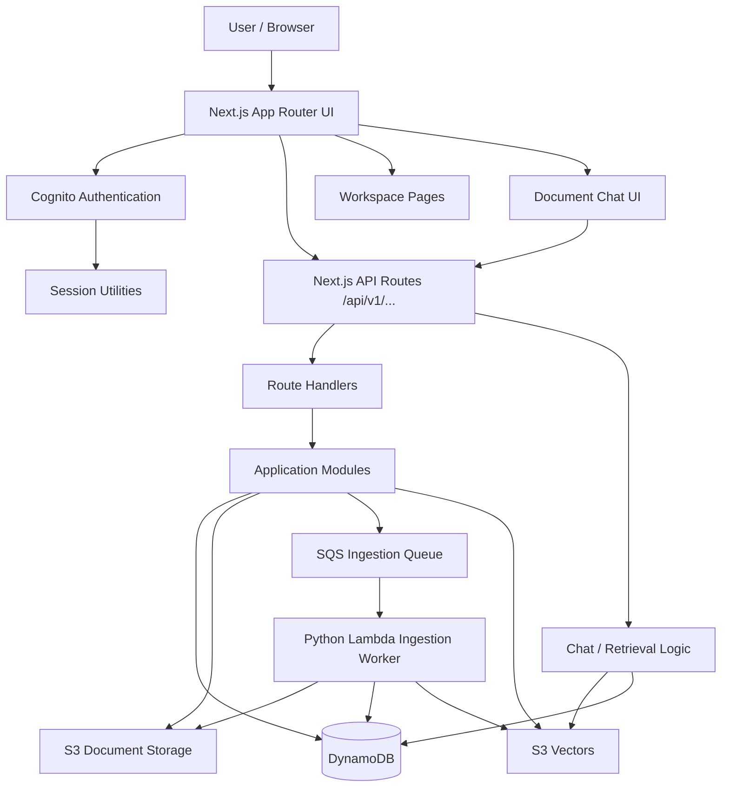
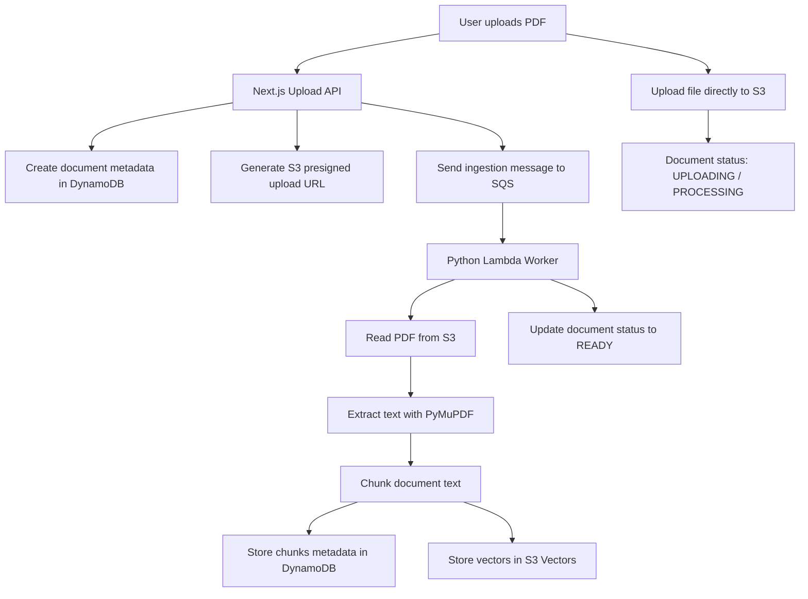
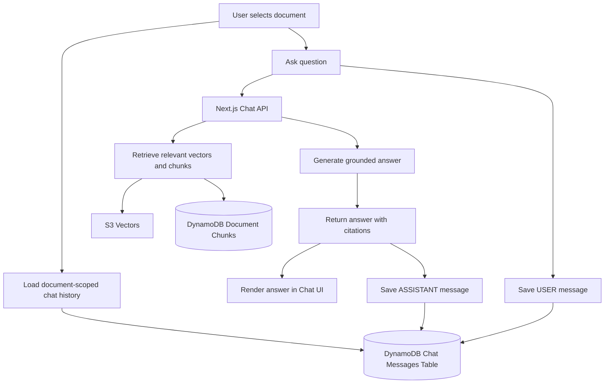

# High-Level Architecture

AYD Workspace SaaS is a workspace-first document and chat application built with Next.js App Router and AWS-native backend services.

The current architecture supports Cognito authentication, workspace management, document upload, asynchronous document ingestion, vector-based retrieval, document-grounded chat, citations, and document-scoped chat history.

---

## Current Architecture Diagram



---

## Document Upload and Ingestion Flow



---

## Document Chat Flow



---

## Architecture Layers

### 1. Frontend Layer

The frontend is built with Next.js App Router.

Main responsibilities:

- Workspace dashboard
- Document list
- Document upload UI
- Document selection
- Mobile-responsive chat UI
- Citation/source panel
- PDF opening from citations

Common locations:

```txt
src/app
src/components
src/modules
```

---

### 2. Authentication Layer

AYD uses Amazon Cognito for authentication.

Current auth responsibilities:

- Cognito login flow
- Session handling
- Current user lookup
- Protected application routes
- API-level authorization checks

API routes use shared session utilities such as:

```txt
getSession()
```

---

### 3. API Layer

The backend API is implemented using Next.js route handlers.

Responsibilities:

- Validate request input
- Check authentication
- Check workspace membership
- Call module/repository functions
- Return API responses to the frontend

Routes live under:

```txt
src/app/api/v1
```

Examples:

```txt
/api/v1/auth/me
/api/v1/workspaces
/api/v1/workspaces/[workspaceId]/documents
/api/v1/workspaces/[workspaceId]/documents/[documentId]/chat/messages
```

---

### 4. Domain / Module Layer

Business logic is organized by feature modules.

Examples:

```txt
src/modules/workspace
src/modules/documents
src/modules/chat
```

This keeps route handlers thin and moves application logic into reusable modules.

---

### 5. Data Layer

AYD currently uses DynamoDB for application metadata and chat history.

DynamoDB stores:

- workspaces
- workspace members
- users
- documents
- document chunks
- document-scoped chat messages

Important tables include:

```txt
ayd-workspaces-dev
ayd-workspace-members-dev
ayd-users-dev
ayd-documents-dev
ayd-document-chunks-dev
ayd-chat-messages-dev
```

---

### 6. Document Storage Layer

Uploaded documents are stored in Amazon S3.

S3 stores the original uploaded files.

DynamoDB stores related metadata such as:

- document ID
- workspace ID
- file name
- storage key
- file type
- size
- status
- chunk count
- timestamps

---

### 7. Ingestion Layer

Document ingestion is asynchronous.

Current ingestion flow:

```txt
S3 upload
→ SQS message
→ Python Lambda worker
→ PDF extraction
→ chunking
→ DynamoDB chunk metadata
→ S3 Vectors
→ document status READY
```

This keeps large document processing outside the main Next.js request lifecycle.

---

### 8. Vector / Retrieval Layer

AYD uses S3 Vectors for vector storage and retrieval.

Current responsibilities:

- Store chunk vectors
- Retrieve relevant chunks for user questions
- Support grounded document answers
- Provide citation/source information for chat responses

---

### 9. Chat History Layer

AYD stores chat history in DynamoDB.

Chat messages are scoped by:

```txt
workspaceId + documentId
```

This means each PDF/document has its own independent chat history.

Chat message key pattern:

```txt
pk = WORKSPACE#<workspaceId>#DOCUMENT#<documentId>
sk = MESSAGE#<createdAt>#<messageId>
```

Allowed message roles:

```txt
USER
ASSISTANT
```

When a document is deleted, related chat messages are also deleted.

---

### 10. Cleanup / Delete Flow

When a document is deleted, AYD cleans up related resources.

Delete flow:

```txt
Delete S3 document file
→ Delete document chunks from DynamoDB
→ Delete vectors from S3 Vectors
→ Delete document chat messages from DynamoDB
→ Delete document metadata from DynamoDB
```

This prevents orphan document data, vectors, chunks, and chat messages from staying in the system.

---

## Current Phase 1 Status

AYD Phase 1 is completed.

Completed scope:

- Workspace-first app structure
- Cognito authentication
- Workspace creation and listing
- Workspace member management
- Document upload
- S3 document storage
- DynamoDB metadata storage
- SQS + Lambda ingestion pipeline
- PDF text extraction and chunking
- S3 Vectors integration
- Document-grounded chat
- Citations/source panel
- PDF citation opening
- Mobile responsive chat UI
- Document-scoped chat history
- Chat cleanup on document delete

---


